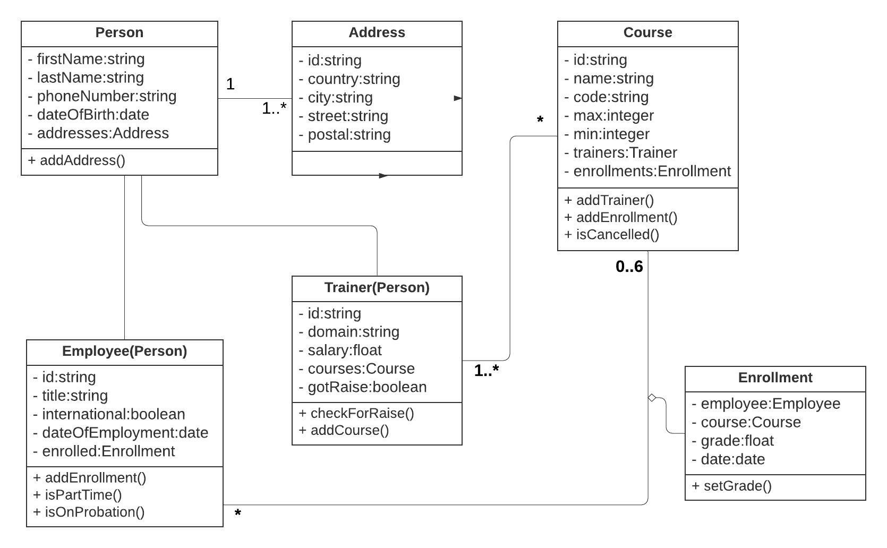

<h2>Object Oriented Design with UML and Python Implementation</h2>

In the project I utilize two methods: <b>OOAD and UML</b>.

  

Due to wikipedia:

<i><b>Object-oriented analysis and design (OOAD)</b> is a technical approach for analyzing and designing an application, system, or business by applying object-oriented programming, as well as using visual modeling throughout the software development process to guide stakeholder communication and product quality.</i>

<i><b>Unified Modeling Language (UML)</b> is a general-purpose, developmental, modeling language in the field of software engineering that is intended to provide a standard way to visualize the design of a system.</i>

<h3>Demo</h3>
<ul>
  <li>Step 1st: preparing UML diagram that shows all of the classes along with associations bettwen them.</li>
  <li>Step 2nd: reflecting UML diagram with Python code.</li>
  <li>Step 3rd: creating class instances with in-memory data.</li>
  <li>Step 4th: feeding instances into SQL database (Python sqlite3).</li>
</ul>

<h3>UML Diagram</h3>
<ul>
  <li>UML diagram:</li>
</ul>

